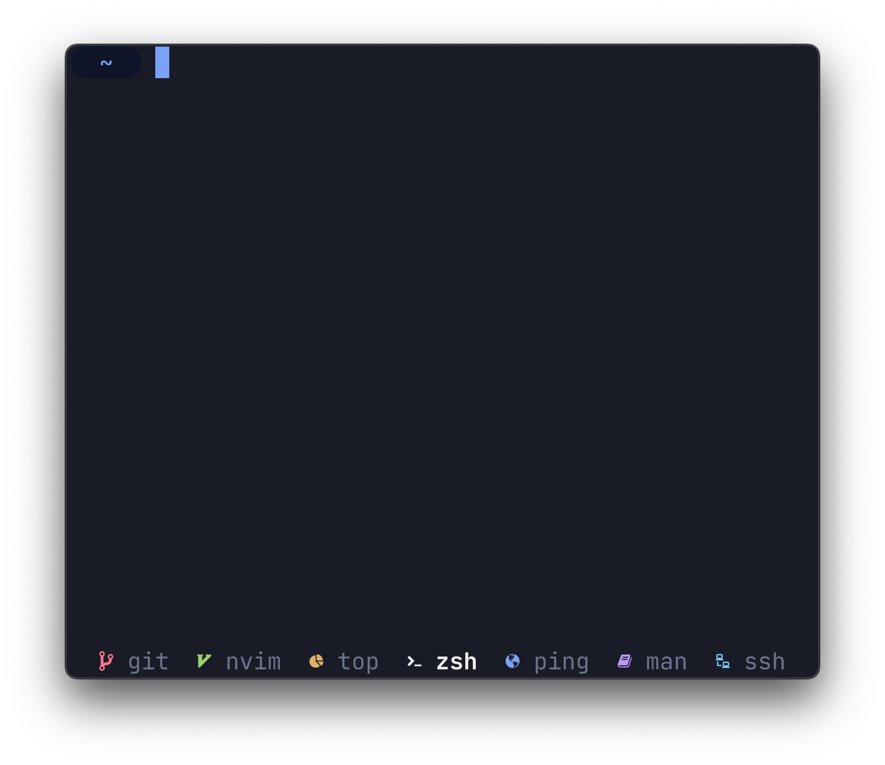
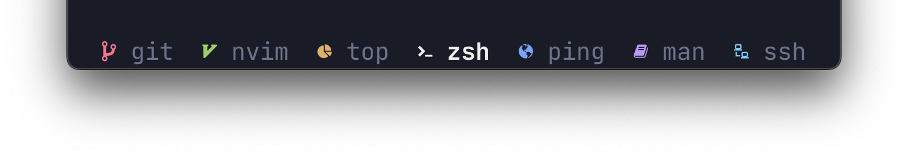

<p align="center">
  
</p>

<p align="center">
  <code>despell</code> puts icons in <code>tmux</code>'s status line
</p>


<p align="center">
  
</p>

## Installing

### Homebrew

```console
# Install
brew install bensadeh/despell/despell

# Test
despell zsh
```

### With Go Install

Make sure that `$GOPATH/bin` is in your `PATH` variable.

```console
# Install
go install github.com/bensadeh/despell@latest

# Test
despell zsh
```

### From source

Make sure that `$GOPATH/bin` is in your `PATH` variable.

```console
# Install
go install

# Test
despell zsh
```

### Dependencies

`despell` requires your terminal to use a [Nerd Fonts](https://www.nerdfonts.com)-patched font.

## How does it work?

At its core, `despell` is a just a [hash map](https://en.wikipedia.org/wiki/Hash_table) lookup table. 
It takes a string (process name) as input and returns a string (icon) as output. 

## Enabling despell
### How to use

`despell` was created to add a corresponding Nerd Font icon next to the currently running command in `tmux`'s
status line. To use `despell`, edit the following segments in your `~/.tmux.conf`:
- `window-status-current-format` (active window)
- `window-status-format` (inactive window)

Inside these segments, call `#(despell #W)` to map the command name to their respective icons. 

Have a look at the layouts [below](#Examples) for an example of the configuration used in the screenshot.

### Settings
#### Update frequency

To configure how often `tmux` refreshes its status line, add the following command to 
your `~/.tmux.conf`:

```tmux
# Update the status line every X seconds
tmux set -g status-interval 5
```

#### Per-icon colors

To let `despell` set the icon color and override your theme settings, run `despell` with the 
`-c` flag:

```tmux
#(despell -c #W)
```

#### Emojis

To use emojis instead of Nerd Fonts, run `despell` with the `-e` flag:

```tmux
#(despell -e #W)
```

### Examples

#### [Colors](/examples/colors.tmux)
<p align="center">
  
</p>

#### [No Colors](/examples/no-colors.tmux)

<p align="center">
  
</p>

#### [Emojis](/examples/emoji.tmux)

<p align="center">
  
</p>


## Overriding and adding icons

Override default icons or add new mappings by creating an `overrides.json` and placing it in
`~/.config/despell/overrides.json`. You can either use [this example file](/examples) or the snippet 
below as a starting off point:

`unknownCommand` is a reserved keyword for commands without mappings.

```json
{
  "unknownCommand": {
    "Icon": "?",
    "Color": "green",
    "Emoji": "❔"
  },
  "ssh": {
    "Icon": "◇",
    "Color": "red",
    "Emoji": "🌐"
  },
  "zsh": {
    "Icon": "❤",
    "Color": "blue",
    "Emoji": "💙"
  }
}
```

## Is a mapping missing?
Let me know by opening an Issue, Discussion or PR.

## Under the hood

Screenshots use:

* [iTerm2](https://iterm2.com/) for the terminal
* [Palenight Theme](https://github.com/JonathanSpeek/palenight-iterm2) for the color scheme
* [JetBrains Mono](https://github.com/JetBrains/JetBrainsMono) for the font
