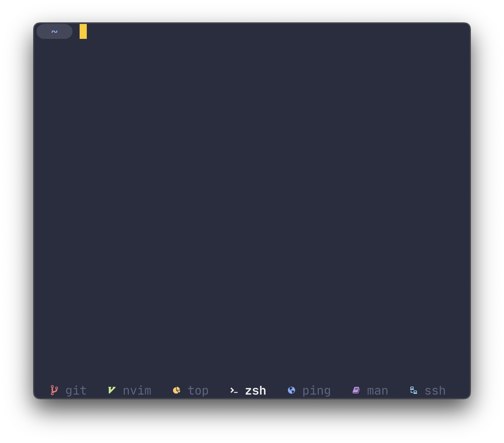
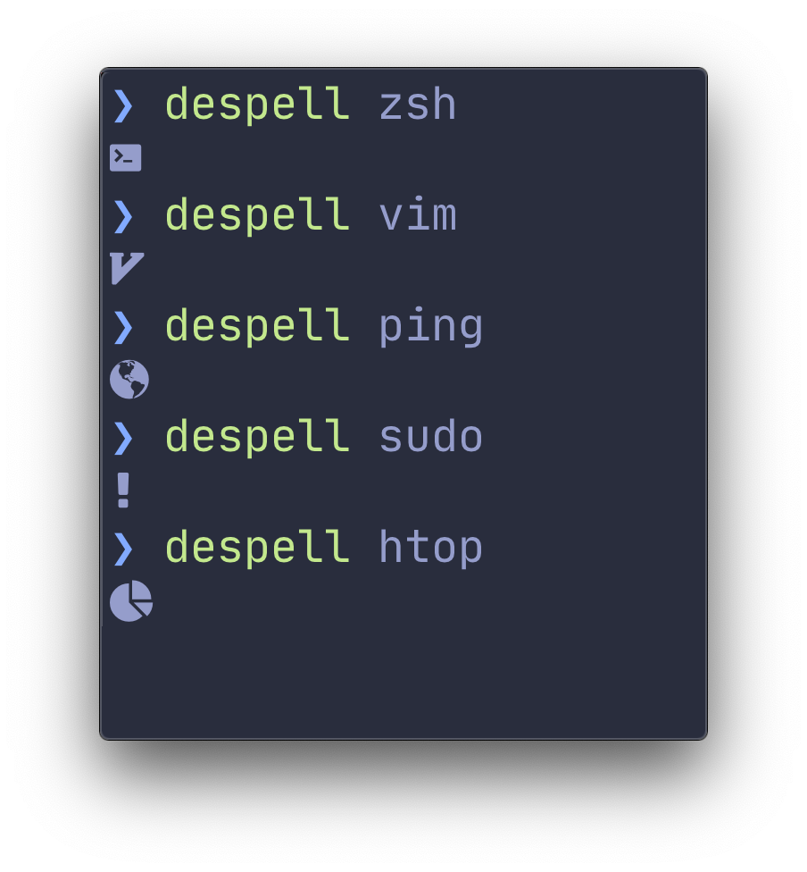
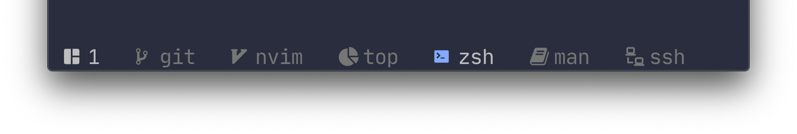
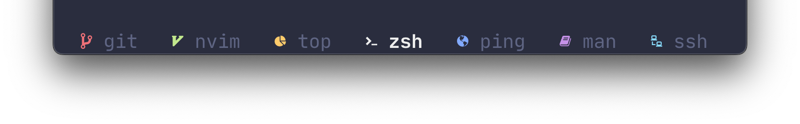
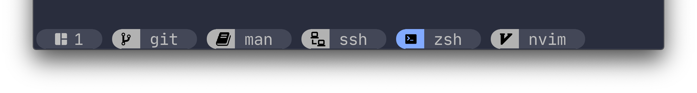

<p align="center">
  
</p>

<p align="center">
<a href="https://github.com/bensadeh/magica/releases" target="__blank">
<a href="/CHANGELOG.md" target="__blank"></a>
<a href="/LICENSE" target="__blank"></a>
</p>


#

`magica` is a tool for showing icons in `tmux`'s status line. 


<p align="center">
  
</p>

## Installing



### Homebrew

```console
# Install
brew install bensadeh/magica/magica

# Run
despell zsh
```

### From source

Make sure that `$GOPATH/bin` is in your `PATH` variable.

Then run the following commands: 

```console
# Install
go install

# Run
despell zsh
```

### Dependencies

`magica` relies on [Nerd Fonts](https://www.nerdfonts.com) for providing the icons.

## How does it work?

At its core, `magica` is a little more than a fancy [hash map](https://en.wikipedia.org/wiki/Hash_table) lookup table. 
It takes a process name as input and returns an icon as output. 

If no matches are found, an `unknownCommand` icon is returned.

## Enabling magica
### How to use

`magica` was created to add a corresponding Nerd Font icon next to the currently running command as reported by `tmux`
in the status line. To enable the icons, you must redefine the `window-status-current-format` (active window) and 
`window-status-format` (inactive window) segments in `~/.tmux.conf`.

Inside these segments, call `#(despell #W)` to call `magica` and map the command name to an icon. Have a look at the layouts 
below for an example of the configuration used in the screenshot. Note that the colors may need to be adjusted to 
your current color scheme if you're not using the `palenight` theme.

Since `magica` simply returns an icon for a given string, it can be easily extended to give icons to **session names** 
(`#(despell #{session_name})`) or even **hostnames** (`#(despell #H)`).

### Settings
#### Update frequency

To configure how often `tmux` refreshes its status line, add the following command to 
your `~/.tmux.conf`:

```tmux
# Set how often to update the status line in seconds
tmux set -g status-interval 5
```

#### Per-icon colors

To let `magica` set the icon color and override your theme settings, run `despell` with the 
`-c` flag:

```tmux
#(despell -c #W)
```

### Examples

#### [Minimal](/examples/minimal.conf)
<p align="center">
  
</p>

#### [Colors](/examples/colors.conf)

<p align="center">
  
</p>

#### [Rounded](/examples/rounded.conf)

<p align="center">
  
</p>


## Overriding and adding icons

Override default icons or add new mappings by creating an `overrides.json` and placing it in
`~/.config/magica/overrides.json`. You can either use [this example file](/examples) or the snippet 
below as a starting off point:

```json
{
  "ssh": {"Icon": "◇", "Color": "red"},
  "zsh": {"Icon": "❤", "Color": "blue"},
  "unknownCommand": {"Icon": "?", "Color": "green"}
}
```

## Default mappings

`magica` aims to include the most commonly used commands out of the box. Please let me know if 
you think there is a command that should be included in the default mappings.

For commands that are less common, please use `overrides.json` locally. 


## Under the hood

Screenshots use:

* [iTerm2](https://iterm2.com/) for the terminal
* [Palenight Theme](https://github.com/JonathanSpeek/palenight-iterm2) for the color scheme
* [JetBrains Mono](https://github.com/JetBrains/JetBrainsMono) for the font
